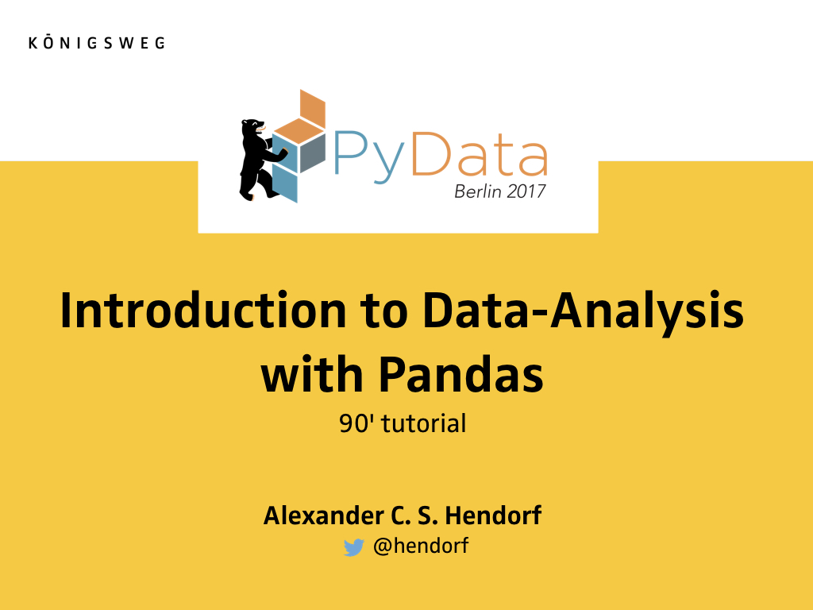

# Introduction to Data-Analysis with Pandas

## Follow-along tutorial PyData Berlin 2017

Pandas is the Swiss-Multipurpose Knife for Data Analysis in Python. With Pandas dealing with data-analysis is easy and simple but there are some things you need to get your head around first as Data-Frames and Data-Series. 

The tutorial provides a compact introduction to Pandas for beginners for I/O, data visualisation, statistical data analysis and aggregation within Jupiter notebooks.

### Installation

Having [Anaconda](https://www.continuum.io/downloads) installed simply create your ENV with 

```
git clone https://github.com/alanderex/pandas-pydata-berlin-2017
cd pandas-pydata-berlin-2017
conda env create -n pandas-pydata-berlin-2017 -f environment.yml
jupyter notebook
``` 



* reading and writing data across multiple formats (CSV, Excel, JSON, SQL, HTML,…)
    * CSV
    * JSON
    * HTML
    * Clipboard
    * EXCEL
* data
    * .info
    * .describe

* Selecting Data {from Paris Index talk with visualisation}
    * Colums
    * Rows
    * returns a copy // inplace
    * boolean indexing via visualisation | after selecting same order

* operations
    * add/substract
    * multiply
    * mention Index but don't go deep

* data visualisation
* work with built-in data visualisation

* statistical data analysis and aggregation.

* inner-mechanics of Pandas: Data-Frames, Data-Series & Numpy.

* working and making the most of indexes.

* how to mangle, reshape and pivot
